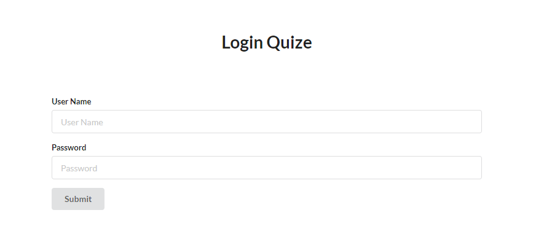

# Javascript Quize for QA

## Login Story

1. 创建LoginStory类，完成Login测试，[如下](#user-case)。
1. 登录页面URL <https://everdoc.github.io/hellojs/quize/login.html>, [如下](#login-screen)
    * 只有用户名输入`admin`，密码输入`taylor2018`才能得到`Successful!`的结果
    * 否则只会得到`BAD Login`
1. 请继承Story类, [如下](#class-story)，并在构造函数中定义4个新成员变量
    * `username`
    * `password`
    * `expected`
    * `actual`
1. 复写When方法把When条件中的用户名`admin`和密码`taylor2018`截取出来，分别赋值给成员变量`username`和`password`
1. 复写Then方法把Then结果中的`successful!`截取出来，赋值给成员变量`expected`
1. 在Then方法中通过webdriver进行自动化测试
    1. 访问登录页面，输入`username`和`password`
    1. 点击`Submit`按钮，读取`<h1 id='result'></h1>`中的内容并赋值给`actual`
    1. 比较（断言）`expected`和`actual`是否相等，相等输出 `The case is PASS`，否则输出 `The case is FAIL`

### Preference

* [Javascript for QA](https://everdoc.github.io/hellojs/)
* [Javascript for QA (code)](https://github.com/EverDoc/hellojs/)
* [[Selenium] 从一个实例开始，访问Baidu并进行关键字搜索](https://www.cnblogs.com/orangeseason/p/4627765.html)

### User Case

* Given: open login page
* When: enter user name [admin]
* When: enter password [taylor2018]
* Then: [successful!]

### Login Screen



### class Story

```javascript
export default class Story{
    constructor(content){
        this.content=content;
    }

    Given(context) {
        // console.log(`It's a given: ${message}`);
        this.event("given",context);
    }

    When(context){
        // console.log(`It's a when: ${message}`);
        this.event("when",context);
    }

    Then(context){
        // console.log(`It's a then: ${message}`);
        this.event("then",context);
    }

    event(event,context){
        console.log(`It's a ${event}: ${context}`);
    }

    Play(){
        for (let index = 0; index < this.content.length; index++) {
            const strContent = this.content[index];
            const key=strContent.substr(0,strContent.indexOf(":"));
            const message=strContent.substr(strContent.indexOf(":")+1);
            switch (key) {
                case "Given":
                    this.Given(message);
                    break;
                case "When":
                    this.When(message);
                    break;
                case "Then":
                    this.Then(message);
                    break;
                default:
                    this.event(key,message);
                    break;
            }
        }
    }
}
```