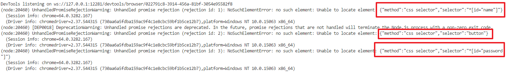

# Review for Gu Pin Jing

## Comments

You could see below error sometimes, if so I have some suggestions, please refer to the the comments starting with the suffix "X - [BW] -"

|Driver promise error|
|--------------------|
||

```javascript
// loginstory.mjs

    Then(context){
        super.Then(context);
        this.expected=this.arrContext(context);
        //console.log(this.expected);

        let driver=new webdriver.Builder().forBrowser("chrome").build();
        driver.manage().window().maximize();
        const msg_url="https://everdoc.github.io/hellojs/quize/login.html";
        driver.get(msg_url);
        // 1 - [BW] - Must call the method findElement when the DOM of browser is ready
        //            otherwise would cause unexpected situation
        //let username=driver.findElement(webdriver.By.id('name'));
        //let password=driver.findElement(webdriver.By.id('password'));
        //let submit=driver.findElement(webdriver.By.tagName('button'));
        //let result=driver.findElement(webdriver.By.id('result'));
        // 2 - [BW] - don't use finding-element as condition here
        //driver.wait(submit.isEnabled(),1000*60)
        driver.wait(webdriver.until.elementLocated(webdriver.By.tagName('button')),1000*60)
        .then((loading)=>{
            // 1 - [BW] - move finding the field of name here
            let username=driver.findElement(webdriver.By.id('name'));
            username.sendKeys(this.username)
            .then((send)=>{
                // 1 - [BW] - move finding the field of password here
                let password=driver.findElement(webdriver.By.id('password'));
                password.sendKeys(this.password)
            .then((send)=>{
                // 1 - [BW] - move finding the field of submit here
                let submit=driver.findElement(webdriver.By.tagName('button'));
                submit.click()
                .then((isclick)=>{
                    // 1 - [BW] - move finding the field of result here
                    let result=driver.findElement(webdriver.By.id('result'));
                    result.getText()
                    .then((message)=>{
                        //console.log(message);
                        if(message!==''){
                            this.actual=message;
                            //console.log(this.actual);
                            // 3 - [BW] - It's better that asserts between the variables of this.actual and this.expected instead of hard-code
                            //            Hard-code always ask you to revise the code everytime when the user-case content gets unchanged
                            //            For example, when the expected result to 'Login!' you have to revise the hard-code to 'Login!' in the assert logic,
                            //            So if used the variable putting the values, whatever the usecase content changes your code would always work.
                            if(this.actual=='Successful!')console.log('The case is PASS');
                            else if (this.actual=='BAD Login')console.log('The case is FAIL');
                            driver.quit();
                    }
                });

                });
            })
            })
        });

    }
}

```